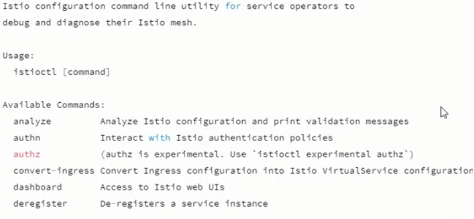
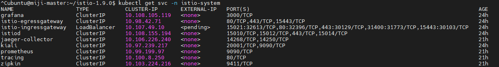
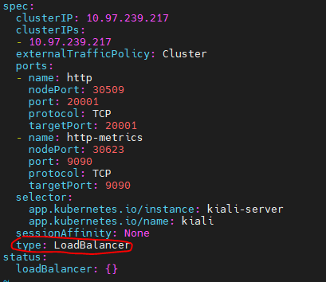
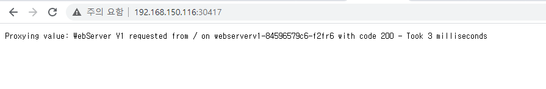
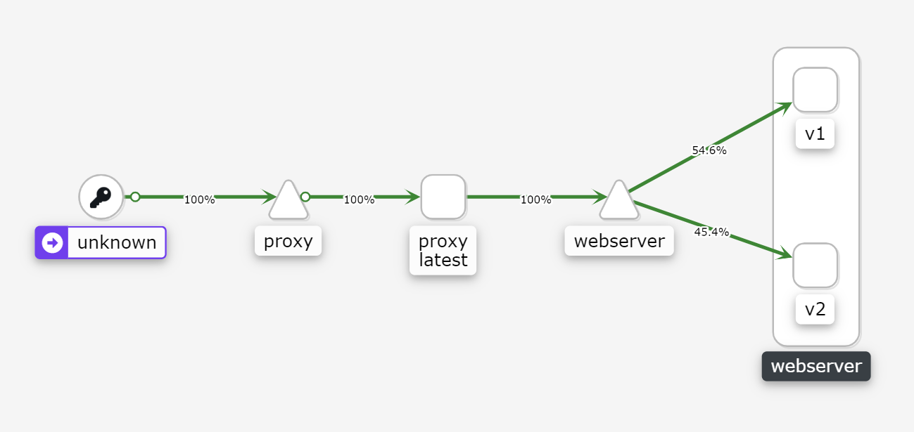

# Istio 설치 및 적용

이론 : [Istio 이론 정리](https://www.notion.so/Docker-Kubernetes-c9168f4ed5f243da84b19111cd59210b)

### Istio 동작 방법

1. 전반적인 네트워크 인프라의 관리 및 devops 팀이 정의한 정책과 트래픽 규칙 적용을 강제하는 **컨트롤 플레인(Control Plane)**을 배포함
2. 마이크로서비스의 각 인스턴스 옆에서 모든 수신 및 발신 네트워크 트래픽을 가로채는 프록시 역할의 보조 컨테이너인 **"사이드카(Sidecar)"**를 포함하고 있는 **데이터 플레인(Data Plane)**을 배치. 사이드카는 고성능 오픈소스 프록시(proxy)인 Envoy로 구현


### 설치시,

- **Istio Pilot**을 사용한 트래픽 관리: Istio Pilot은 컨텐츠 및 정책 기반의 로드 밸런싱 및 라우팅을 제공할 뿐만 아니라 메쉬에 있는 서비스를 나타내는 표준화된 형식으로 관리
- **Istio Auth**를 사용한 접근 제어: Istio Auth는 서비스 간 통신을 보장하고 키와 인증서를 관리하는 키 관리 시스템도 제공
- **Istio Mixer**를 사용한 모니터링, 레포팅 및 할당량 관리: Istio Mixer는 요청 추적 수집뿐만 아니라 마이크로서비스에 대한 상세한 모니터링 및 로그 데이터 수집 기능을 제공. 서비스 소비자가 화이트 리스트에 있는지 여부를 확인하는 사전 검사나 속도 제한과 같은 할당량 관리 등도 Mixer를 사용하여 구성.  


### 단점

- 트래픽 라우팅을 엄격하게 제어
- Istio 데이터 플레인 밖에 있는 외부 서비스로 나가는 트래픽의 경우 외부 서비스 연결에 사용되는 프로토콜을 기반으로 하는 *특수 구성*을 통해서만 활성화 됨


### Istioctl 최신 버전 다운로드 및 설치

```bash
$ curl -L https://istio.io/downloadIstio | sh -
$ cd istio-최신버전
$ export PATH=$PWD/bin:$PATH
$ istioctl
```



```bash
$ istioctl manifest apply --set profile=demo
```

-> demo로 설치하면 모든 걸 알아서 설치해줌


### 프로젝트에 istio 적용

```bash
$ istioctl profile list 
```

-> 설치한거 확인

```bash
$ istioctl manifest apply --set profile=demo
```

->Istio, Istiod, Ingress, Egress, Addons 설치됨


### Istio Integrations 설치하기

> 최근 버전 업데이트 하면서 각자 설치하는 방법들로 바뀜

Grafana:

```bash
$ kubectl apply -f https://raw.githubusercontent.com/istio/istio/release-1.9/samples/addons/grafana.yaml
```

Jaeger:

```bash
$ kubectl apply -f https://raw.githubusercontent.com/istio/istio/release-1.9/samples/addons/jaeger.yaml
```

Kiali:

```bash
$ kubectl apply -f https://raw.githubusercontent.com/istio/istio/release-1.9/samples/addons/kiali.yaml
```

Prometheus:

```bash
$ kubectl apply -f https://raw.githubusercontent.com/istio/istio/release-1.9/samples/addons/prometheus.yaml
```

Zipkin:

```bash
$ kubectl apply -f https://raw.githubusercontent.com/istio/istio/release-1.9/samples/addons/extras/zipkin.yaml
```

**추후 kiali 대시보드로 모든 integerations 모니터링 할 것이기 때문에 모두 설치**


```bash
$ kubectl label namespace default istio-injection=enabled
```

->namespace 설정

```bash
$ kubectl apply -f samples/bookinfo/platform/kube/bookinfo.yaml
```

-> book 예제에 istio apply

```bash
$ kubectl get pod
```

->pod 조회 시 details, productpage, ratings, review 3가지 버전 출력


### 게이트웨이 설치와 관찰

```bash
$ kubectl apply -f samples/bookinfo/networking/bookinfo-gateway.yaml
```

-> 게이트웨이 추가 설치

```bash
$ kubectl get gateways
```

->게이트웨이 생성 확인

```bash
$ kubectl get svc -n istio-system -l istio=ingressgateway --all-namespaces
```

->80번 포트에 연결된 포트번호 확인, localhost:포트번호/productpage로 접속


### Kiali 대시보드 연결

```bash
$ kubectl get svc -n istio-system
```

->을 통해서 확인하면 kiali는 타입이 ClusterIP로 되어잇음



포트번호 지정을 위해 

```bash
$ kubectl edit svc kiali -n istio-system
```



빨간 부분을 LoadBalancer로 변경하면 자동으로 포트지정됨

아이피주소:해당 포트 번호/kiali로 접속하면 dashboard 접속됨.


### Book예제 설명


> 이 애플리케이션은 Python, Java, Ruby 및 Node.js의 서로 다른 언어로 작성된 4 개의 마이크로서비스로 구성된 애플리케이션
>
> 예제 [BookInfo](https://istio.io/docs/samples/bookinfo.html) 애플리케이션을 배포하고 사이드카를 주입하여 위에서 언급한 Istio 기능을 얻는 방법

- Envoy는 각 마이크로서비스에 사이드카로 배치
- 데이터베이스 사용 X, 모든 마이크로서비스는 로컬 파일 시스템에 데이터 저장

```bash
$ kubectl get pods

NAME                                        READY     STATUS    RESTARTS   AGE
details-v1-1520924117-48z17                 2/2       Running   0          6m
productpage-v1-560495357-jk1lz              2/2       Running   0          6m
ratings-v1-734492171-rnr5l                  2/2       Running   0          6m
reviews-v1-874083890-f0qf0                  2/2       Running   0          6m
reviews-v2-1343845940-b34q5                 2/2       Running   0          6m
reviews-v3-1813607990-8ch52                 2/2       Running   0          6m
```

- 쿠버네티스 Pod의 마이크로서비스 옆에서 실행되는 각자의 Envoy 사이드카를 볼 수 있음
  - productpage
  - details
  - ratings
  - reviews

페이지를 새로 고침할때마다 reviews영역이 변경됨:


**reviews** 서비스에는 3 가지 버전의 *(reviews-v1, reviews-v2, reviews-v3)* 배포가 있기 때문에 바뀜. Istio의 로드 밸런서는 라운드 로빈 알고리즘을 사용하여 이 서비스의 세 가지 인스턴스를 반복.


### Istio 예시

출처: [nodejs예제](https://octopus.com/blog/istio/the-sample-application)

서비스를 요청하고 응답을 하는데 걸린 시간 반환하는 애플리케이션<br/>

결과 창:




- 웹서버 버전: 
  - version: v1
  - version: v2
- 프록시 배포 리소스가 생성한 Pod 리소스로 트래픽을 전달하는로드 밸런서 서비스 리소스가 있으며,이 리소스는 배포 리소스 webserverv1 및 webserverv2에 의해 생성된 Pod 리소스의 콘텐츠를 요청해서 해당 콘텐츠가 브라우저로 반환
- 프록시 앱에선 모든 웹서버 포드 리소스를 가르키고 있고 webserverv1 또는 webserverv2 중 하나에 연결함. 연결된 포드을 검색하는 데 걸린 시간도 확인 가능

Kiali 대시보드:

