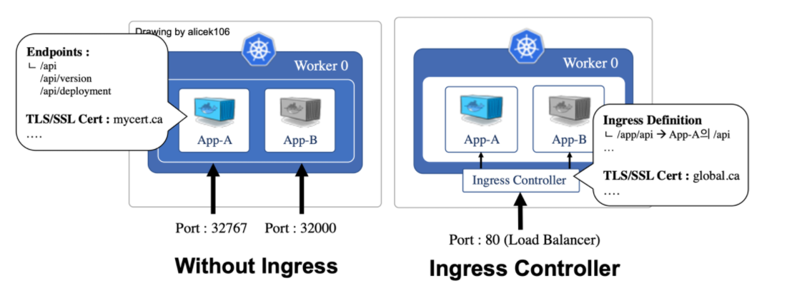

# Kubernetes Ingress, Egress

> 네트워크 트래픽은 Ingress와 Egress로 구분됨

Ingress: 외부로부터 서버 내부로 유입되는 네트워크 트래픽 

Egress: 서버 내부에서 외부로 나가는 트래픽 

- 쿠버네티스의 Ingress: 외부에서 쿠버네티스 클러스터 내부로 들어오는 네트워크 요청, 즉 Ingress 트래픽을 어떻게 처리할지 정의
  - Ingress는 외부에서 쿠버네티스에서 실행 중인 Deployment와 Service에 접근하기 위한, 일종의 관문 (Gateway) 같은 역할을 담당
  - Ingress를 사용하지 않았다고 가정했을 때, 외부 요청을 처리할 수 있는 선택지는 NodePort, ExternalIP 

- Ingress 요청을 처리하기 위한 Service는 일반적으로 클라우드 플랫폼에서 제공되는 Load Balancer 타입의 Service 사용
- Private Cloud에서 운영하고 있는 서버에 Ingress를 직접 구축하게 된다면, Service의 Type으로서 NodePort(권장X) 또는 ExternalIP, MetalLB 등을 대신 사용 가능

### 쿠버네티스에서 Ingress 사용하기

> 준비물: YAML 파일에서 [kind: Ingress]로 정의되는 Ingress 오브젝트, Ingress 규칙이 적용될 Ingress Controller

예시:

1. alicek106.com 이라는 호스트 명으로 접근하는 네트워크 요청에 대해서 Ingress 규칙을 적용하되
2. http 프로토콜을 통해
3. /api/hostname-service라는 경로로 접근하는 요청을
4. hostname-service라는 이름의 Service의 80 포트로 전달

**그러나** 위 YAML 파일로부터 Ingress를 생성해도 아무 일도 일어나지 않는다. Ingress는 단지 Ingress 규칙을 정의하는 선언적인 오브젝트일 뿐, 외부 요청을 받아들이는 실제 서버가 아니기 때문이다. Ingress는 **Ingress Controller**라고 하는 특수한 서버 컨테이너에 적용되어야만 Ingress에 적용된 규칙이 활성화된다. 즉, Ingress Controller가 외부로부터 네트워크 요청을 수신했을 때, Ingress 규칙에 기반해 이 요청을 어떻게 처리할지를 결정한다.

- 직접 Ingress Controller를 구동하려면 Nginx 웹 서버 기반의 Nginx Ingress Controller를 사용하거나 클라우드 플랫폼에 위임하려면 GKE의 기능을 사용 가능

출처: [Ingress](https://blog.naver.com/alice_k106/221502890249)