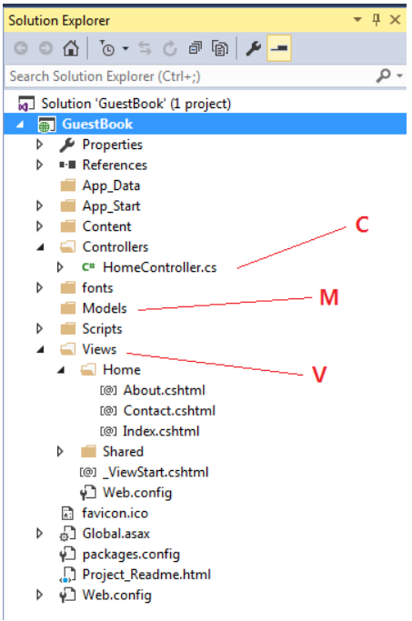

# MVC 모델_ASP.NET

> ASP.NET의 MVC는 Models, Views, Controllers 등 3개의 폴더를 기본으로 생성, 고정된 것으로 변경 안함!!

- Views 폴더의 경우 Controller의 이름에 맞는 서브폴더를 생성하고 그 안에 View 파일을 생성
  - HomeController의 경우 그 컨트롤러에서 사용하는 뷰는 Views/Home/* 밑에 있어야 함
  - MVC에서 View가 없는 WebAPI를 구현하는 경우 보통 Controller 혹은 Controller+Model만 사용




## Controller

- 사용자가 생성한 컨트롤러는 System.Web.Mvc.Controller 클래스로부터 상속되어 Framework에서 제공하는 다양한 기능들을 사용하게 됨


- HomeController.cs는 Controllers 폴더안에 생성되어 있음
- 사용자가 생성한 컨트롤러는 System.Web.Mvc.Controller 클래스로부터 상속되어 Framework에서 제공하는 다양한 기능들을 사용하게 됨
- 각 웹페이지는 /{컨트롤러명}/{메서드명}으로 접근, 컨트롤러명 HomeController에서 뒤의 Controller는 빼고 쓰게 됨
- 메서드명은 ActionResult (혹은 그 파생클래스)를 리턴하는 public 메서드에 대한 이름

> MVC는 이와 같이 개발자가 일일이 모든 것을 Configuration(배열,배치)하게 하지 않고 프레임워크가 정한 관례를 그냥 따르도록 하고 있는데, 이를 **"Convention over Configuration"**이라 함


### Action 메서드

> Action메서드는 웹 Request를 받아들여 어떤 처리를 한 후 출력물인 ActionResult 객체를 리턴함

```c#
using System.Web.Mvc;
 
namespace WebApplication1.Controllers
{
    public class HomeController : Controller
    {
        public ActionResult Index()
        {
            //MVC의 Controller 베이스클래스의 View() 메서드를 호출한 것으로,
            //Controller.View() 메서드는 (MVC Framework에서 미리 지정한) 
            ///Views/Home 폴더 (/Views/{컨트롤러명}) 밑에서 메서드와 동일한 이름인
            //Index.cshtml (C#의 경우) 파일을 HTML 랜더링하여 결과인 
            //ViewResult (ActionResult의 파생클래스) 객체를 리턴
            return View();
        }
 
        public ActionResult About()
        {
            //ViewBag은 dynamic 타입이므로 임의의 속성을 생성해서 지정
            //ViewBag.Message 속성에 값을 지정하였는데, 이 ViewBag은 View (/Views/Home/About.cshtml) 로 넘어가 View 안에서 사용
            ViewBag.Message = "Your application description page.";
 
            return View();
        }
    }
}
```

Action 메서드는 HTML을 리턴하는 것 이외에 파일, 문자열, JSON, 자바스크립트 등을 리턴할 수 있고, 또 한 다른 URL로 리다이렉트할 수 있음

| ActionResult 파생클래스                                      | 설명                            | Controller상의 메서드             |
| ------------------------------------------------------------ | ------------------------------- | --------------------------------- |
| ViewResult<br />PartialViewResult                            | HTML을 리턴                     | View()<br />PartialView()         |
| EmptyResult                                                  | 빈 결과                         |                                   |
| ContentResult                                                | 문자열을 리턴                   | Content()                         |
| FileContentResult,<br />FilePathResult,<br />FileStreamResult | 파일을 리턴                     | File()                            |
| JavaScriptResult                                             | 자바스크립트 리턴               | JavaScirpt()                      |
| JsonResult                                                   | JSON 리턴                       | Json()                            |
| RedirectResult<br />RedirectToRouteResult                    | 새 URL 혹은 Action으로 Redirect | Redirect()<br />RedirectToRoute() |
| HttpUnauthrizedResult                                        | HTTP 403 리턴                   |                                   |

**예제:**

```c#
// 예제 A
public ActionResult NewGuid()
{
    string guid = Guid.NewGuid().ToString();
             
    var result = new ContentResult();
    result.Content = guid;
    return result;
}
//자주 사용되는 Result들에 대해 Mvc.Controller 베이스클래스에서 이미 Wrapper 메서드로 갖고 있는데, 위 테이블에 표시되어 있듯이 Content() 라는 메서드를 직접 사용
// 예제 B : 위 표현을 더 간단히
public ActionResult NewGuid()
{
    string guid = Guid.NewGuid().ToString();
 
    return Content(guid);
}
```

**파일 다운로드 및 업로드:**

```c#
// 파일 다운로드 예제
[HttpGet]
public FileResult DownloadSample()
{
    // 웹서버 상의 파일 절대 경로 구함
    string filePath = HttpContext.Server.MapPath("~/Downloads/Sample.dll");
 
    // 파일 읽기
    byte[] fileBytes = System.IO.File.ReadAllBytes(filePath);
     
    // FileResult 리턴
    return File(fileBytes, System.Net.Mime.MediaTypeNames.Application.Octet, Path.GetFileName(filePath));
}
 
// 파일 업로드 예제
[HttpPost]
public HttpResponseMessage Upload()
{
    var req = HttpContext.Request;
 
    //string authVal = req.Headers["Authorization"];            
    //if (authVal != "BASIC SGVsbG8=")
    //{
    //    return new HttpResponseMessage(HttpStatusCode.BadRequest);
    //}
 
    if (req.Files.Count < 1)
    {
        return new HttpResponseMessage(HttpStatusCode.BadRequest);
    }
 
    foreach (string file in req.Files)
    {
        var uploadFile = req.Files[file];
        var outputFilePath = HttpContext.Server.MapPath("~/Uploads/" + uploadFile.FileName);
        uploadFile.SaveAs(outputFilePath);                
    }
 
    return new HttpResponseMessage(HttpStatusCode.OK);
}
```

- 웹서버에서 파일을 업로드 받기 위해서는 기본적으로 HttpContext.Request.Files의 내용을 서버상에 저장
- Request.Files는 파일정보와 파일데이타를 가지고 있는데, 복수 파일들이 업로드될 수 있으며, 각 파일당 다른 이름으로 웹서버에 저장


<hr>

## Model

> 외부 데이타 소스를 엑세스하기 위한 ADO.NET 클래스들이나 Entity Framework 클래스 등이 Model에 놓이게 되며, 비지니스 로직이나 유틸러티 클래스 등을 이곳에 두게 된다. 
>
> 모델은 /Models 폴더에 일반적으로 .cs 파일로 저장되는데, /Models 안에 서브폴더를 만들어 클래스들을 그룹으로 묶을 수도 있다. 모델 파일을 생성하기 위해서는 /Models 폴더에서 우측하고 Add -> New Item 하여 새 .cs 파일을 추가하면 된다. 이렇게 생성된 모델 클래스는 Controller에 의해 사용됨


**로그인명과 암호를 체크하는 로직:**

```c#
// 파일: /Models/LoginManager
 
public class LoginManager
{
    public static bool CheckLogin(string username, string password)
    {
        var strConn = WebConfigurationManager.ConnectionStrings["DeafultConnection"].ConnectionString;            
        using (SqlConnection conn = new SqlConnection(strConn))
        {
            conn.Open();
            string sql = "SELECT NULL FROM Login WHERE Username=@user AND Password=@pwd";
            SqlCommand cmd = new SqlCommand(sql, conn);                
            cmd.Parameters.AddWithValue("@user", username);
            cmd.Parameters.AddWithValue("@pwd", password);
            object res = cmd.ExecuteScalar();
 
            return res != null;
        }
    }
}
```

컨트롤러에서 호출되어 사용되는 코드:

```c#
// 파일: /Controllers/LoginController
 
public class LoginController : Controller
{
    // GET: /Login/Check
    public ActionResult Check()
    {
        string user = Request["username"];
        string pwd = Request["password"];
 
        bool success = LoginManager.CheckLogin(user, pwd);
 
        ViewBag.Success = success;
        return View();
    }
}
```

- MVC는 데이터 액세스를 위해 Entity Framework(EF)를 주로 사용


## View

> View는 기본적으로 HTML, CSS로 UI를 구성하지만, Dynamic하게 HTML을 생성하기 위해 MVC에서 특별한 구문 및 MVC Helper 함수들을 제공

- MVC에서 가장 많이 쓰이는 View Engine은 Razor 엔진
- MVC의 View 파일은 /Views/{컨트롤러명} 폴더에 놓이게 되는데, {컨트롤러명}은 Controller를 뺀 부분을 의미
  - View 파일의 이름은 Action 메서드의 이름과 동일해야 하는데, 예를 들어 HomeController의 메서드가 **Create(**) 이면, View 파일은 **/Views/Home/Create.cshtml** 이 됨

**View 레이아웃:**

```c#
@{    
    Layout = "~/Views/Shared/_MyLayout.cshtml";
}
 
<p>
    My View
</p>
```

- 디폴트로 디폴트 레이아웃인 /Views/Shared/_Layout.cshtml 을 사용하게 됨
- 일반적으로 View에서 공통적으로 사용되는 파일은 /Views/Shared 폴더에 놓음. Layout 파일은 여러 계층을 가질 수 있는데, 예를 들어 A 라는 View는 Layout1.cshtml 이라는 레이아웃을 사용할 수 있고, Layout1.cshtml 은 다시 _Layout.cshtml 을 자신의 레이아웃으로 사용할 수 있음


**Partial View:**

> View의 특정 부분을 띄어내어 별도의 부분 View로 만들어 사용할 수 있음
>
> 여러 View 안에 임의로 넣어서 사용할 수 있는 장점

```c#
<p>
    My View
</p>
 
@{     
    Html.RenderPartial("bottomPartialView.cshtml");    
}
```


**Controller에서 View로 데이터 전달 방식:**

```c#
// 컨트롤러에서 View로 데이터 넘기기
public ActionResult MyView(int id)
{
    // ViewBag에 임의의 속성 지정
    ViewBag.Title = id + " 자료";
 
    // ViewData 해시테이블 사용
    ViewData["MethodName"] = nameof(ShowGuest);
 
    Guest guest = new Guest
    {
        Id = 1,
        Name = "Alex",
        CreateDate = DateTime.Now,
        Message = "Congrats!"
    };
 
    return View(guest);  // View()에 모델 객체 지정
}
 
// 모델 클래스
public class Guest
{
    public int Id { get; set; }
    public string Name { get; set; }
    public DateTime CreateDate { get; set; }
    public string Message { get; set; }
}
 
 
// View에서 전달된 데이타 사용
@using GuestBook.Models
@model Guest
 
<h2>@ViewBag.Title</h2>
<p>
    Method: @ViewData["MethodName"]
    <br />
     
    <div>@Model.Id : @Model.Name</div>
    <div>
        @Model.Message
    </div>    
</p>
```

- MVC의 Controller는 데이타 혹은 객체를 View에 보낼 수 있는데, 일반적으로 Controller의 View() 메서드의 파라미터로 Model 객체를 보내거나 ViewBag (dynamic) 혹은 ViewData (컬렉션)에 담아 데이터를 넘김
- 뷰에서 사용할 데이터 모델을 넘기기 위해서 Controller.View(모델객체) 메서드의 파라미터로 넘길 수 있음
  - 넘어온 모델 객체의 타임을 @model과 함께 지정하고, 뷰 본문에서 "Model.속성명"과 같이 사용하면 됨(ex. 모델 객체에서 Message라는 속성이 있으면, @Model.Message와 같이 지정)
- ViewData는 Dictionary(해시테이블) 타입으로 Key에 Value를 지정해서 데이터를 전달

<hr>

#### 새로운 페이지 생성 시

1. Views아래 해당 폴더(ex.Home) 아래 뷰 생성
2. 해당하는 컨트롤러는 Controllers 폴더 아래 생성(같은이름+Controller라는 파일명으로 생성)
3. _Layout.cshtml에 해당 페이지로 이동할 수 있는 링크 추가!
   1. ex. a 태그 href에 뷰 이름 추가